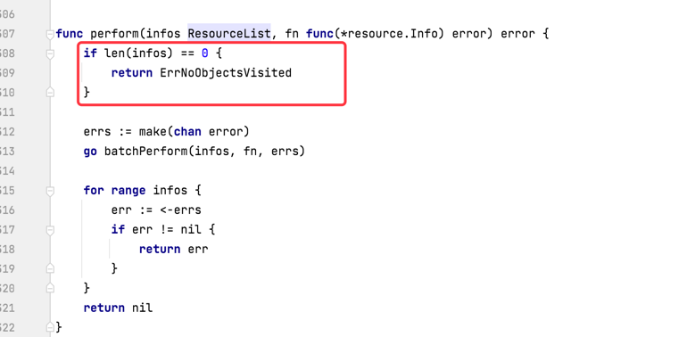
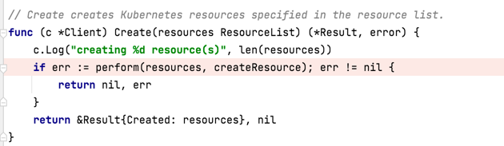
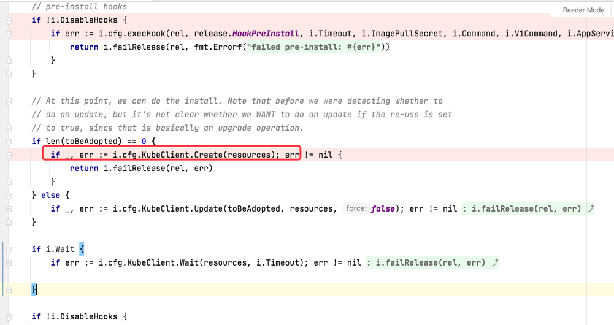

# Helm安装钩子资源chart包报错

## 问题描述
通过helm go客户端执行redis chart包安装时报no objects visited错误

## 问题背景
此处安装报错的redis chart是拿官方的chart包改造的，改造点是将资源添加钩子注释，使redis chart下的所有资源都变成了钩子资源

## 问题分析

### 通过抛错信息结合断点分析

抛错位置如下，在perform方法开始就判断infos是否没有值，如果没有值直接返回ErrNoObjectsVisited错误信息，其内容便是no objects visited

perform方法在helm客户端创建资源方法client.Create中被调用

在我们调用helm安装chart包的install.Run方法调用上述client.Create方法时抛出了异常no objects visited

install.Run方法中传入的resources为空，导致perform方法校验没有通过抛出异常。而resource的来源为chart包解析之后的非钩子资源的manifest文件，
由于redis chart包中所有资源都设置为钩子资源，导致抛错了

其实pre-install、post-install类型钩子就是在上述报错地方之前、之后执行

## 解决方案
调整chart 不要只有钩子资源

