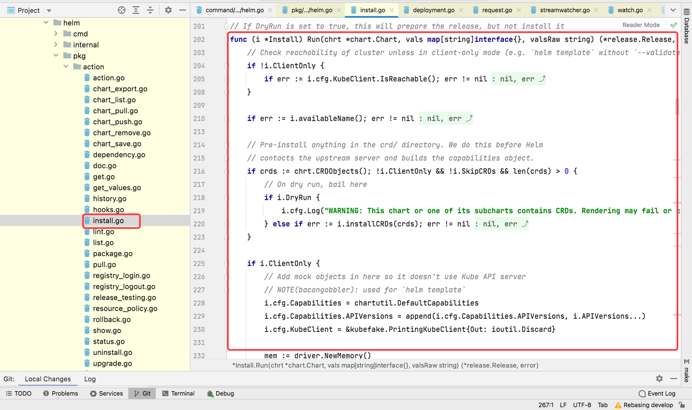
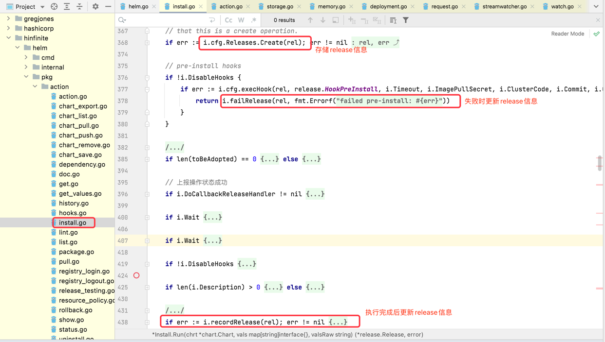
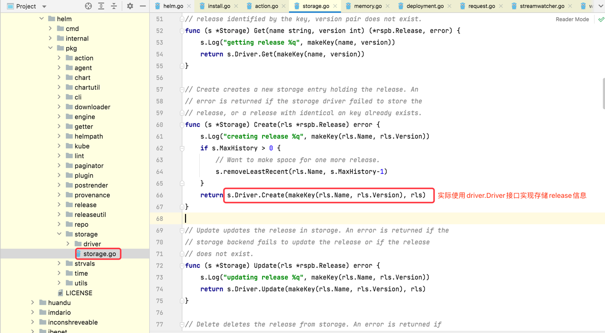
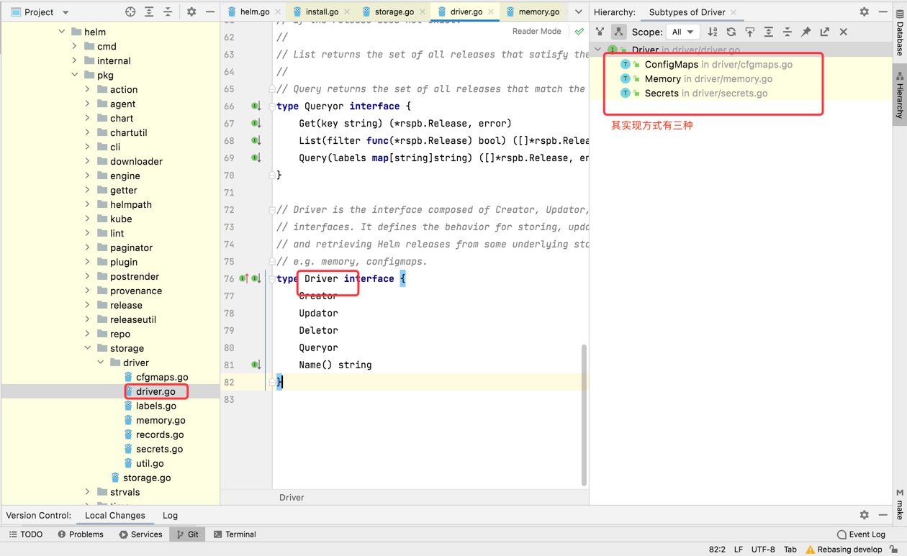
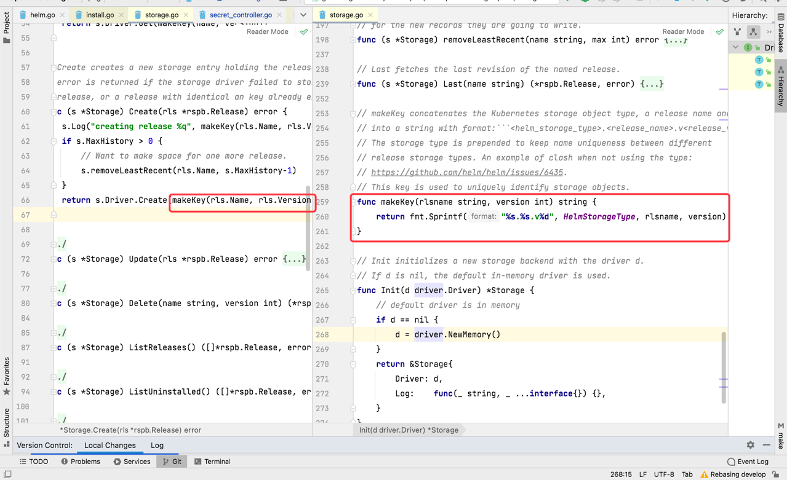

# 监听Helm release资源
基于helm做部署管理工具时，可能想要管理用户已有环境，这时需要将已有环境中的release信息上报到业务系统中。当用户在环境中部署新的release时，
也需要实时监听并上报回来。下面将讲解如何去监听release资源

## helm release存储源码分析
查看helm install源码，在helm/pkg/action/install.go中的run方法会执行实际的release安装


在install.run()方法中首先通过install.createRelease()方法创建release，然后在解析组装完chart模版中资源文件后，通过storage.Storage的
Create方法将release信息进行存储，实际使用的是driver.Driver的Create方法进行release信息的存储。driver.Driver有三种存储实现，在helm2
中默认使用ConfigMaps；在helm3中默认使用Secrets；也可以使用内存存储即通过map存储






无论存储到K8s的ConfigMaps还是Secrets或者内存map中，其资源名称或者map的key的命名规则满足：sh.helm.release.v1.<release的名称>.<release的版本>


## 如何监听
监听K8s中的CRD资源一种方式是通过资源的Watch方法监听,类似如下方式
```
func (c *Client) WaitAndGetCompletedPodPhase(name string, timeout time.Duration) (v1.PodPhase, error) {
	client, _ := c.Factory.KubernetesClientSet()
	to := int64(timeout)
	watcher, err := client.CoreV1().Pods(c.namespace()).Watch(metav1.ListOptions{
		FieldSelector:  fmt.Sprintf("metadata.name=%s", name),
		TimeoutSeconds: &to,
	})

	for event := range watcher.ResultChan() {
		p, ok := event.Object.(*v1.Pod)
		if !ok {
			return v1.PodUnknown, fmt.Errorf("%s not a pod", name)
		}
		switch p.Status.Phase {
		case v1.PodFailed:
			return v1.PodFailed, nil
		case v1.PodSucceeded:
			return v1.PodSucceeded, nil
		}
	}

	return v1.PodUnknown, err
}
```

- 所有K8s的资源都会存储在etcd中，当客户端通过APIServer操作资源时，会将资源存储在etcd中，而etcd在存储信息时会发送事件到APIServer。
  当APIServer接收到创建pod资源事件后，会将事件发给其他监听pod资源的监听器，这样我们也能监听到pod的变化做出响应的处理
  
另一中方式是使用operator-sdk，这种方式其实也是借助于K8s中CRD资源的Watch方法，但使用operator-sdk监听资源代码结构会更好，便于统一控制，
而且当处理失败后还能重新接到事件继续处理，直到成功。具体使用方式可以参考[官网](https://sdk.operatorframework.io/docs/building-operators/golang/references/client/)

在这里我们要监听release信息可以通过监听ConfigMaps、Secrets资源，判断其名称是否是以sh.helm.release.v1.开头，如果是则认为是helm release
发生变化，通过解析出的release名称和命名空间名称，可以使用helm go客户端获取到release的详细信息，将这些release信息处理后上报到业务系统，
release的所有信息包括参数、其下各种资源详细都能获取并上报

但对于使用内存map存储的release资源无法监听处理，因为其是从当前执行的helm客户端中获取，两个helm客户端是不能共享其内存中的map缓存的


